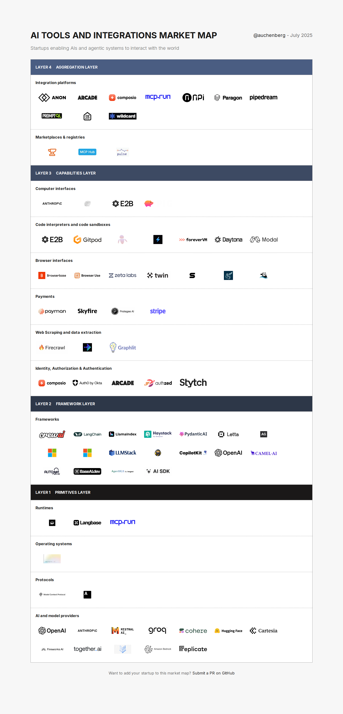

<h1 align="left">
	AI Tools and Integrations Market Map
</h1>

<h3 align="let">
  A market map of startups enabling AIs and agentic systems to interact with the world
</h3>

<h5 align="center"><a href="#how-to-contribute">Click here to add your startup to this market map 👉🖱️</a></h5>

 
## Criteria

To be included in this map, a startup must:

- Have a product that enables AIs and agentic systems to interact with the world

## How to Contribute

To contribute to this list:

1. Fork the repository
1. Add your startup in the appropriate category in the file [src/data/market-map.json](src/data/market-map.json)
1. Add logo under the [public/images](public/images) folder if have a special logo
1. Submit a PR with a compelling rationale for its acceptance

## Contributing

Please read the [contribution guidelines](CONTRIBUTING.md) before submitting a pull request.

## Credits

A big thanks to [Daytona](https://daytona.io/) for the inspiration with [AI Enablement Stack](https://github.com/daytonaio/ai-enablement-stack).

## License

This project is licensed under the MIT License - see the [LICENSE](LICENSE) file for details
